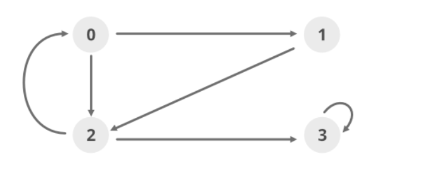

## Graph Theory 

A graph G =  (V,E) has collection of Vertex V and ordered or un-ordered edges E. There are two popular data structures to store the graph i.e. Adjacency list and Adacency Matrix. Both have their advantages and disadvantages. 

Item               | Adj List   |  Adj Matrix |  Time Complexity | 
|-----------------:|:----------:|:------------:|:----------------|
Finding between vertex  |O(N) | O(1) | |
Finding degree of vertex | O(N) | O(N^2) | |
Memory  | O(M+N) | O(N^2) ||
Traverse graph | O(N+M) | O(N^2) ||
Edge insertion or deletion | O(N) | O(1) || 

Given Edge list , to covert and create adj list (for directed graph)

```python
adj_list = [[] for _ in range(num_vertex)]
# edge list = [[1,0], [0,1]]
for (src, dest) in edge_list:
    adj_list[src].append(dest)

```

### Problem 1. Detect Cycle in a Directed Graph
https://www.geeksforgeeks.org/detect-cycle-in-a-graph/




adjaceny list of the graph 
```python
adj_list = [[1,2], [2], [0,3], [3]]
```

To detect cycle in a graph it should have any back-edge from node to it's ancestor or itself. How do we keep track of the back-edge ? 

We can use DFS to scan through each vertex and it's neighbors at the same time keep a recursive stack. This rec_stack will keep track of all the visited vertices from edge and it's will be reset to False once we explore all neighbors of vertex.

here is psuedo-code 
```
1. create two flag list , visited and re_stack = num_vertices in graph
2. for vertex in graph:
        if visited[vertex] == False:
            cycle_util(graph, vertex, visited, re_stack)
    return False 
3. Inside cycle_util(graph, vertex, visited, re_stack)
    vistied[vertex], re_stack[vertex] = True, True 
    # DFS Step
    for neighbor in graph[vertex]:
        if visited[neighbor] == False:
            cycle_util(graph, neighbor, visited, re_stack)
        elif re_stack[neighbor] == True:
            return False

    re_stack[vertex] = False ## Important Step as it restore the stack.    return False


```

## Code in Action 

assuming graph is given as defaultdict of list

```python
graph_loop = defaultdict(<class 'list'>, {0: [1], 1: [2], 2: [3]}) , expected output = True
graph_no_loop = defaultdict(<class 'list'>, {0: [1], 2: [3], 3: [2]}) , expected_output= False

```

```python
def cycle_util(graph, vertex, visited, rec_stack):

    visited[vertex] = True
    rec_stack[vertex] = True 
    
    for neighbor in graph[vertex]:
        if visited[neighbor] == False:
            if cycle_util(graph, neighbor, visited, rec_stack) == True:
                return True
        elif rec_stack[neighbor] == True:
            return True 

    rec_stack[vertex] = False
    return False

def isCyclic(n, graph):

    rec_stack = [False] * n 
    visited = [False] * n 

    for i in range(n):
        if visited[i] == False:
            if cycle_util(graph, i, visited, rec_stack) == True:
                return True 
    return False 

```


This is used to solve a course schedule problem as below :
```
There are a total of numCourses courses you have to take, labeled from 0 to numCourses-1.

Some courses may have prerequisites, for example to take course 0 you have to first take course 1, which is expressed as a pair: [0,1]

Given the total number of courses and a list of prerequisite pairs, is it possible for you to finish all courses?
```
https://leetcode.com/problems/course-schedule/
